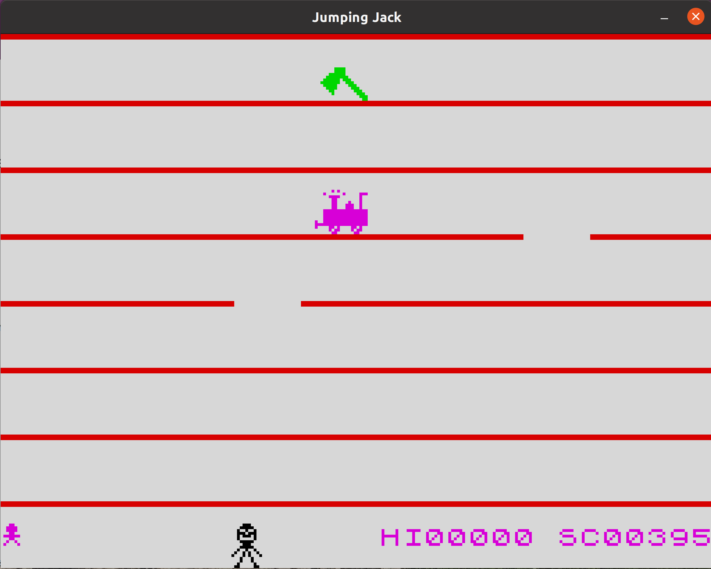

# Jumping Jack re-implementation for modern systems

This is a re-implementation of the famous game for ZX Spectrum 16/48K 8-bit
home computers. While it is possible to run the game in an emulator, or play
it online, it is also nice to have a native version. This will preserve the
legacy for a bit more time.

The idea was to mimic the original game as much as possible. The Python3
version goes a long way down this path. Graphics and sounds are original. Jack's
movement is very close, but I haven't bothered to mimic the exact timings
(number of frames while a sprite stays the same). Gaps are moving differently
compared to the original. Gaps and hazards are generated in a new fashion. One
other notable difference is one bright background flash (compared to two in
the original game) when Jack hits the line during a jump.

I tested the game on a Linux installation, while my sons Mikston and Ukston
tested on Windows. Thanks to them we have the Windows instructions.

## Screenshots

Nothing changed on the graphics front, but it is always nice to see a few
screenshots.

## Windows steps

1. Install Python3 (python.org)
2. Run the following command: `pip install pygame`
3. Pick a directory where you want to clone the project. Open a command prompt
   to that location and run: `git clone “https://github.com/tribula-mel/jumping.git”` 
4. In the command prompt cd into 'jumping' directory and then into py directory
5. To run the game: `python main.py`

## Native executable

It is possible to use `pyinstaller` to create a native executable on a
given platform.

On Linux and Mac:

`pyinstaller --onefile --noconsole --add-data "assets/*.*:assets" main.py`

On Windows:

`pyinstaller --onefile --noconsole --add-data "assets/*.*;assets" main.py`

Or download it from the release section on GitHub.

## Controls

Keyboard is the only option so far. Use 'a' and 'd' for left / right moves,
'w' for jumping, ESC for quitting the game.
